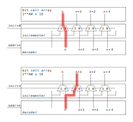

# Misaligned memory access

Misaligned memory access is usually discussed in relation to data memories.
While the described approach can be used for data memories,
the focus will be on instruction fetch for code which is a mix of
RISC-V 32-bit instructions and 16-bit C extension instructions.

The aim of this text is to describe a memory design intended for
single cycle misaligned read/write accesses.
Since the focus is on instruction fetch, the examples will show
32-bit memories with 16-bit read access alignment.

## Instruction fetch buffer

The most common approach to implement misaligned instruction access is
to buffer the upper 16 bits of the previous instruction memory read and
combine them with the lower 16 bits of the current instruction memory read.

This approach is good enough to avoid stalling while reading consecutive instructions.
In case of a branch or jump the buffer would not hold the desired value,
so two memory accesses would be needed, the first one inserting a stall cycle.

A larger buffer combined with branch prediction could reduce the probability of a stall,
it could not avoid it entirely. This text provides another solution.

## RAM with aligned access only

For clarity lets start with a memory setup only allowing 32-bit aligned accesses.


For an aligned access the 32-bit opcode `op` would be a full 32bit read from the memory `mem` at address `addr`.
```verilog
op[31:0] = MEM[addr][31:0];
```
## RAM with external incrementer

For an unaligned access, two consecutive memory locations must be read.
```verilog
OP[31:0] = {MEM[addr+1][15:0], MEM[addr][31:16]};
```
In RTL this can be achieved by splitting the RAM into 2 16-bit parts.
The lower part address would have a mux between `addr` and `addr+1` depending on whether the access is unaligned.
And the data from the two memories would be swapped (data mux) on unaligned access.

The provided image shows address and read data paths,
first for aligned and than for misaligned access.


While the read data multiplexers are reasonably fast,
the adder (actually just an incrementer from half adders)
would add significant delay due to carry propagation.

## RAM with internal incrementer

My proposal is to integrate the incrementer into the memory decoder itself,
but instead of implementing it at the address input,
**it could be implemented after the address is decoded by switching between two consecutive decoded signals**.


In an RTL representation the increment signal `inc` would be used to denote unaligned access and the decoded array is `dec`.
```verilog
for (i=0; i<size; i++)  dec[i] = inc ? (i = addr) : (i = addr-1);
```
The following image shows the incrementer placed between the decoder and the bit cell array.
Each line in the bit array has its own multiplexer.
First the address path without incrementation is shown, below is the path with incrementation.



This approach would avoid the carry chain and would therefore have much better timing.

There are further considerations on how to handle the last and first address, and how to handle memory spaces split into multiple memories. This kind of memory could also be used for instruction caches, and there would be further corner cases to consider.